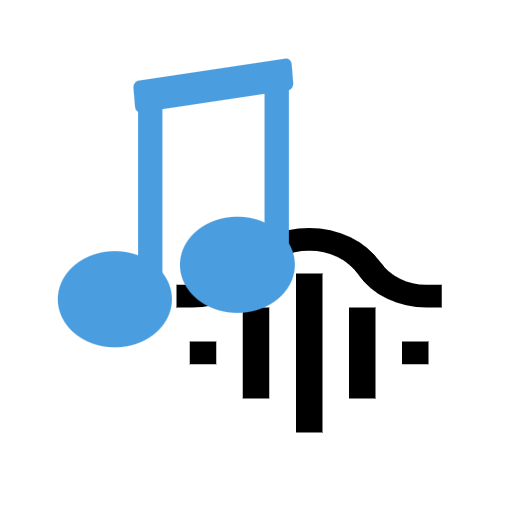
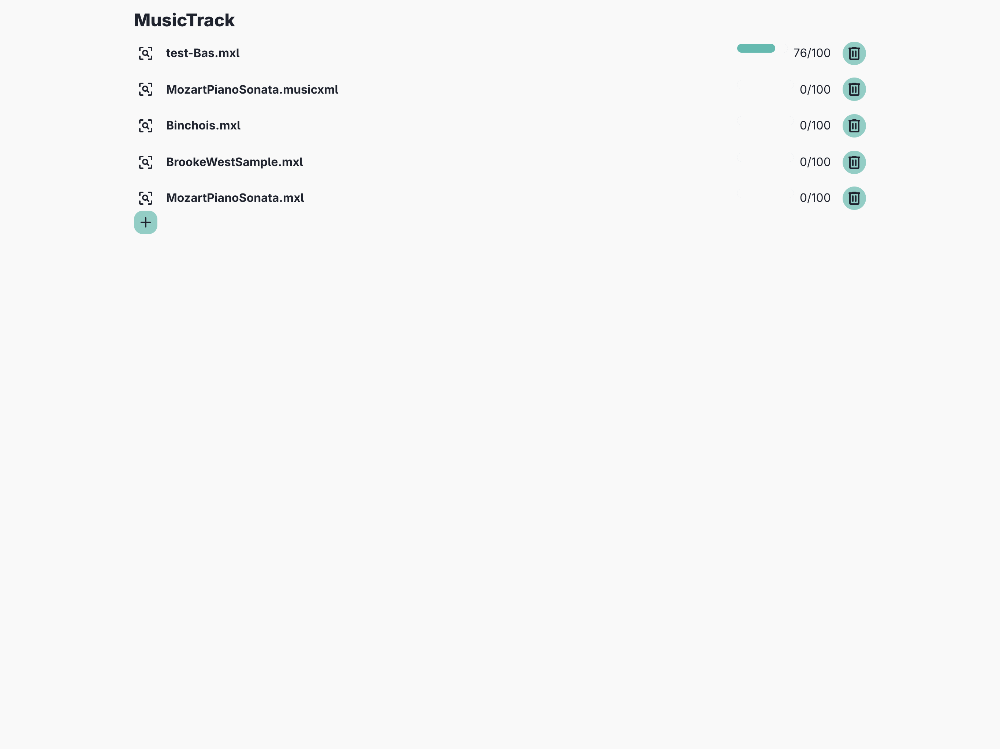
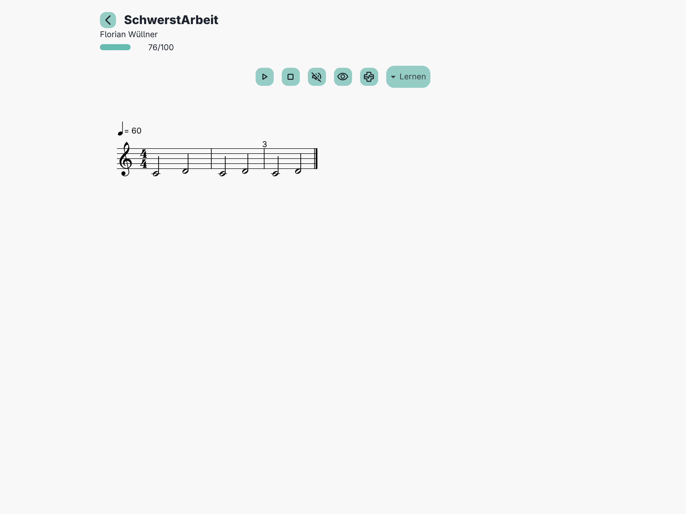
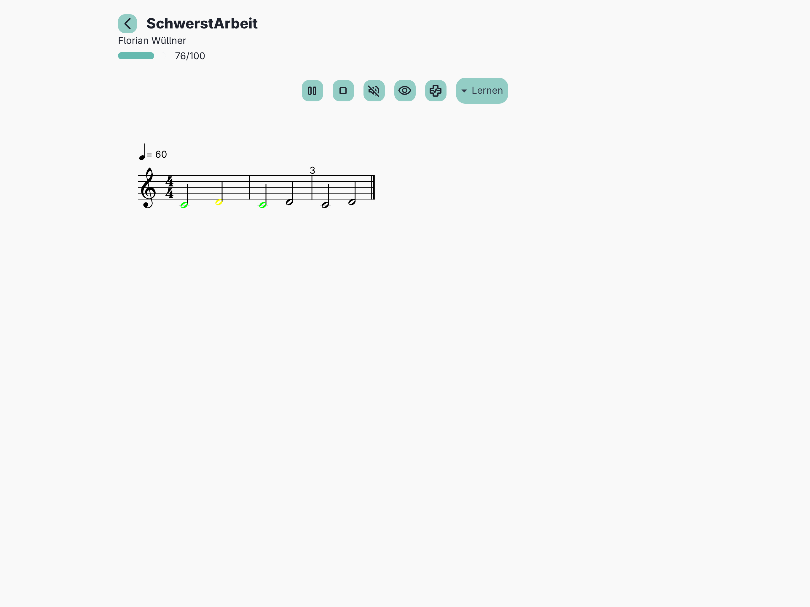
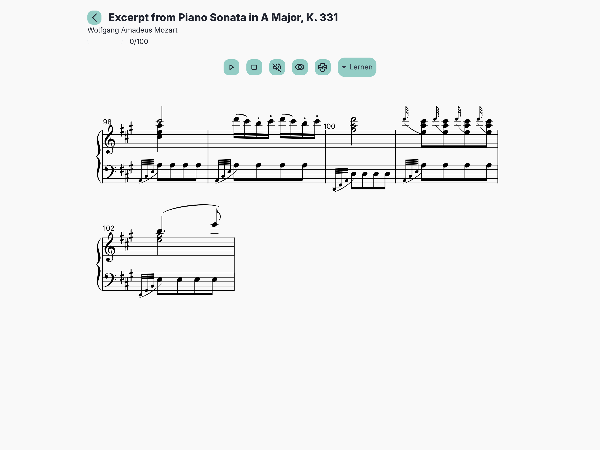

#  MusicTrack

Eine Notenanzeige mit Live Bewertung für Musiker.\
**Lokal** und **sicher!** 

## Features
- **Noten-Anzeige:** Darstellung von Musikstücken (verovio).
- **Live-Bewertung:** Analyse und Bewertung der Mikrophonespur.
- **Interaktive Anpassung:**
  - Instrumente flexibel ein- und ausblenden.
  - Interne Noten-Transformation (z. B. Transponieren).
  - Text-Annotationen direkt über den Noten.
- **Optimiert für Tablets:** ausgelegt für Tablets

## Installation / Nutzung
Einfach [https://app.wuefl.de/musicTrack](https://app.wuefl.de/musicTrack) im Browser öffnen oder als WebApp (PWA) instalieren.
\
Oder die Android App [MusicTrack](https://play.google.com/store/apps/details?id=de.wuefl.app.musicTrack&pcampaignid=web_share)

    
    
    
    

## Technische Basis
Dieses Projekt basiert auf folgenden leistungsstarken Bibliotheken:
- [Verovio](https://www.verovio.org/): Für das High-End-Rendering der Musiknotation (MEI, MusicXML).
- [Smplr](https://github.com/danigb/smplr): Für die authentische Sound-Wiedergabe der Instrumente.
- [IndexedDB (idb)](https://github.com/jakearchibald/idb): Für die effiziente lokale Speicherung von Noten und Fortschritten direkt im Browser.

## Entwicklung
- `main`: Aktuelle Entwicklung.
- `release`: Stabile Versionen.

---
Perfektioniere dein Spiel mit MusicTrack.